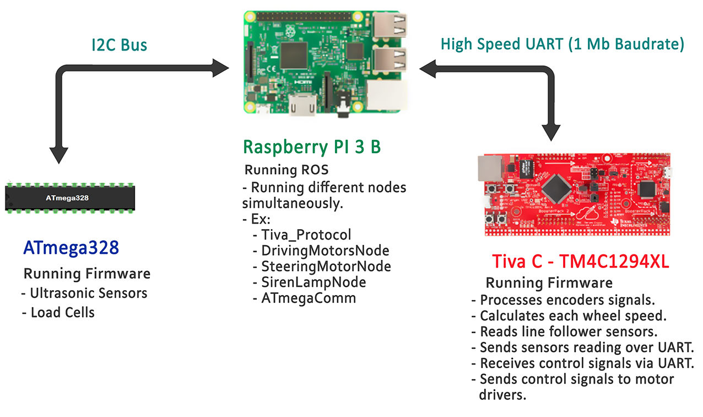

## Autonomous Guided Vehicle
This repository contains the firmware of our graduation project, an autonomous guided vehicle. 

# Description
The overall target function of the vehicle is to collect and carry packages from previously set locations, and to transfer these packages to a dispatch area.
The path of the vehicle is defined apriori and therefore, the goal is maintain and follow the defined path.  

The firmware consists of two main modules:
- Control and decision-making, implemented on Raspberry Pi 3.
- Low-level signal conditioning, implemented on Tuva C - TM4C129 and ATmega328.
The following figure illustrates the architecture of used microcontrollers and developing boards and their corresponding functions:




# Installation

Clone the repo:
``` bash
git clone https://git.uwaterloo.ca/magdaoud/mpc_sim.git
```

We also need to install the following three packages:

``` bash
sudo apt-get install ros-kinetic-ros-control
```

``` bash
sudo apt-get install ros-kinetic-ros-controllers
```

``` bash
sudo apt-get install ros-kinetic-gazebo-ros-control 
```

Then, build using catkin make:
``` bash
catkin_make
```
# Running the simulation

To run the simulation:

``` bash
roslaunch mpc_sim Launch_Simulation.launch 
```

To change the goal pose (change x, y, & theta values)

``` bash
rostopic pub setGoal mpc_sim/Goal_Ackerman "x: 0.0
y: 5.0
theta: 0.0" 
```

**This work is not open for public use and is limited to WATOnomous Design Team use to participate in AutoDrive Challenge.**