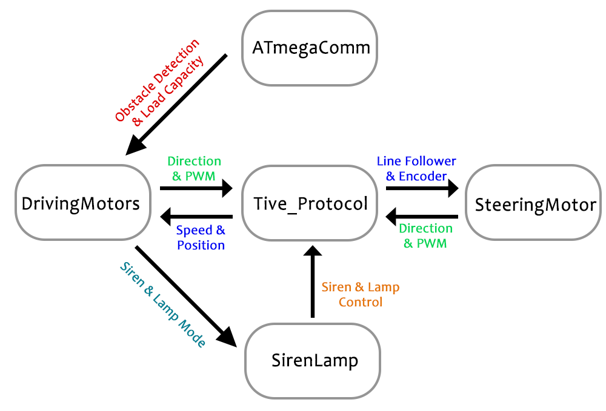
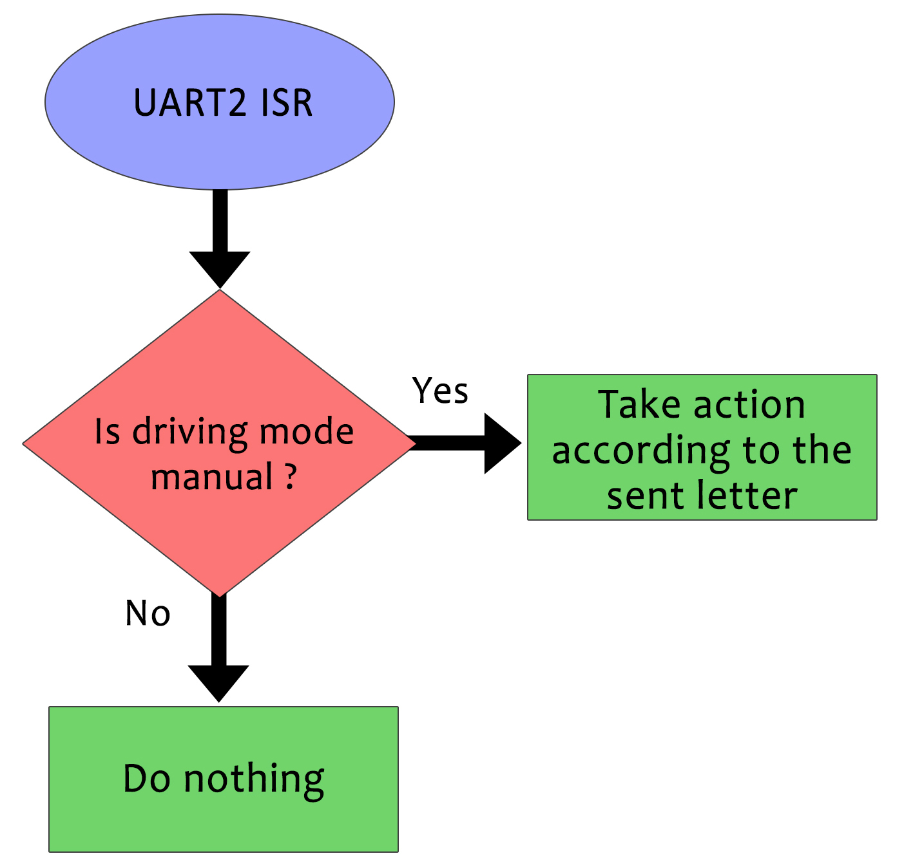

## Autonomous Guided Vehicle
This repository contains the firmware of our graduation project, an autonomous guided vehicle. 

# Description
The overall target function of the vehicle is to collect and carry packages from previously set locations, and to transfer these packages to a dispatch area.
The path of the vehicle is defined apriori and therefore, the goal is maintain and follow the defined path.  

The firmware consists of two main modules:
- Control and decision-making, implemented on Raspberry Pi 3.
- Low-level signal conditioning, implemented on Tiva C - TM4C129 and ATmega328.

The following figure illustrates the architecture of used microcontrollers and developing boards and their corresponding functions:

# Control and decision-making
Robot Operating System (ROS) was used to design control and decision-making module, and several nodes were developed to drive the vehicle accurately on the predefined path. 

The developed ROS nodes are:

# Low-level signal conditioning - Tiva C board

Tiva C - TM4C129 board was used to interface with all peripherals of the vehicle to follow the predefined line smoothly with constant speed.
The peripherals in the system are:

| Peripheral | Function |
| --- | --- |
| Wheels incremental encoders | Measuring vehicle speed and position |
| Steering system absolute encoders | Measuring current steering angle |
| Line follower sensor modules | Detecting the deviation from the predefined line |
| Load cells | Determining the actual load on the vehicle |
| Ultrasonic sensors | Obstacle detection |
| Rear wheel motors | Drive the vehicle on the predefined path |
| Siren | Used as an indicator |
| Rotating lamp | Used as an indicator |

To interface properlly with all peripherals, several ports on Tiva C board were used. The following table summarizes all peripherals connected to the board and their function:

| Port | Pin | Module | Device | Function |  
| --- | --- | --- | --- | --- |
| A | 0 | UART0 (Rx) | PC | On-board diagnostics (OBD) |
| A | 1 | UART0 (Tx) | PC | On-board diagnostics (OBD) |
| A | 4 | UART3 (Rx) | Raspberry Pi | Communication with raspberry pi |
| A | 5 | UART3 (Tx) | Raspberry Pi | Communication with raspberry pi |
| A | 6 | UART2 (Rx) | Bluetooth | Communication with BT module |
| A | 7 | UART2 (Tx) | Bluetooth | Communication with BT module |
| B | 0 | GPIO | Mode Switch | Manual/Autonomous driving switch |
| B | 2 | GPIO | Lamp | Lamp control |
| B | 3 | GPIO | Siren | Siren control |
| C | 4 | Interrupt | Incremental Encoder 1 | Channel Z Counter |
| C | 5 | Interrupt | Incremental Encoder 1 | Channel A Counter |
| C | 6 | GPIO | Incremental Encoder 1 | Channel B Counter |
| D | 0 | SPI - MISO (RX) | Absolute Encoder | SPI2  Master input slave output |
| D | 1 | SPI - MOSI (TX) | Absolute Encoder | SPI2  Master output slave input |
| D | 2 | SPI - SS | Absolute Encoder | SPI2 Select Slave |
| D | 3 | SPI - CLK | Absolute Encoder | SPI2 Clock |
| D | 4 | ADC 7 | Motor driver 1 current sensor | Reading motor driver 1 current |
| D | 5 | ADC 6 | Motor driver 1 current sensor | Reading motor driver 2 current |
| D | 6 | ADC 5 | Motor driver 1 current sensor | Reading motor driver 3 current |
| D | 7 | ADC 4 | Battery volt | Reading battery voltage |
| E | 5-0 | GPIO | Line Follower 1 | Measure deviation to the predefined line |
| F | 0 | PWM01 | Motor Driver 1 | Control Motor 1 Speed |
| F | 1 | PWM02 | Motor Driver 2 | Control Motor 2 Speed |
| F | 2 | PWM03 | Motor Driver 3 | Control Motor 3 Speed |
| H | 4 | Interrupt | Incremental Encoder  | Channel Z Counter |
| H | 5 | Interrupt | Incremental Encoder  | Channel A Counter |
| H | 6 | GPIO | Incremental Encoder 2 | Channel B Counter |
| N | 5-0 | GPIO | Line Follower 2 | Measure deviation to the predefined line |
| P | 1-0 | GPIO | Motor Driver 1 | Motor 1 direction control |
| P | 3-2 | GPIO | Motor Driver 1 | Motor 2 direction control |
| P | 5-4 | GPIO | Motor Driver 1 | Motor 3 direction control |

## Main function:
Main function starts by initializing all ports and timers, then it iterates in a while loop to poll two flags.
First flag indicates that 100 milliseconds have elapsed since sending the last message, so the program creates a new message and sends it to the raspberry pi. The second flag indicates receiving a new message from raspberry pi. The following flowchart shows how main function works:

## General Purpose Timers (Timer0 & Timer1):
Timer0 acts as the main clock for the program. It elapses every 100 microseconds and increments a variable indicating
the time in hundreds of microseconds. Timer1 elapses every 100 milliseconds and its ISR updates robot speed and distance according to encoders’ readings.
The following flowcharts show Timer0 & Timer1 ISRs:

## UART Communication (Port A):
Three different UART modules are programmed to communicate with different peripherals with the maximum possible baudrate for each one.

**UART0** is used to interface with PC at a baudrate of 1.5 Mb/s to debug the program and to monitor sensors readings when necessary. Note that by default while operation, this channel is not used.

**UART2** is used to receive Bluetooth module commands sent from a smart phone at a baudrate of 38400 bit/s. Note that the robot will respond to the sent commands only if the mode switch is on manual drive mode. It is mainly used to test robot actuators and to drive it in emergency cases or when the line is not available.

**UART3** is the main communication module as it responsible for receiving and sending messages from and to raspberry pi. The developed program sends all necessary sensors readings to raspberry pi after performing the required signal processing. In return, raspberry pi responds with the proper control actions to be made based on the sensors readings. The selected baudrate for this module is 1 Mb/s. Note that this mode will be active only if the driving mode switch is on autonomous mode.

The following flowcharts show UART2 & UART3 ISRs:

## Incremental Encoders interface (Port C and Port H):
An incremental encoder provides a number of pulses in one full rotation of the encoder. The used encoders have 3 different channels A, B and Z.
Here we use X2 decoding for the encoders as shown in the following flowchart:

## Absolute Encoder interface, motors current and battery voltage measurements (Port D):
Port D is responsible for reading the absolute encoder attached to the steering system. In addition, it reads the three motors current sensors battery voltage using the port ADC module.

## Line follower Modules (Port E and Port N):
The vehicle is equipped with two line follower modules; each one contains five pairs of IR transmitter and receiver. Port E and Port N are configured as GPIO to read these two modules.

## Pulse Width Modulation Generation (Port F):
The vehicle contains three DC motors; two are attached to the rear wheels while one is attached to the steering system. These motors operate at different speeds according to PWM signal generated from the microcontroller. Port F is configured to generate PWM signal with frequency of 15 kHz, which is adequate to the used motor drivers.

## Motors Direction Control (Port P): 
Port P is configured as GPIO and it is responsible for setting the motors directions.

# Low-level signal conditioning - Atmega328
Atmega328 is used to read the attached load cells to calculate the actual load on the vehicle, and ultrasonic sensors to detect obstacles.  It uses I2C protocol to communicate with Raspberry Pi board.

This work is part of our bachelor's thesis available at